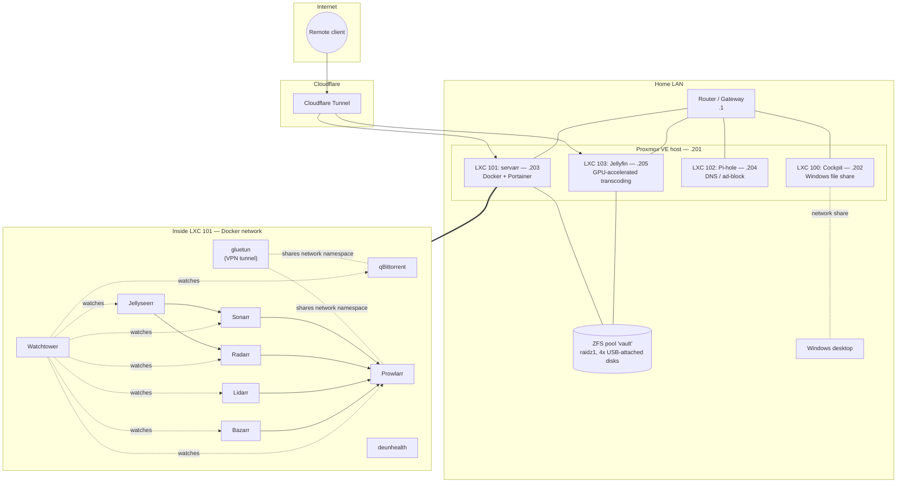

# Homelab

A small self-hosted media + network homelab running on a single repurposed laptop, virtualized with Proxmox. This repo documents how it's built, what connects to what, and what I've learned along the way — partly as a reference for myself, partly as a public build log.

## At a glance

| Layer | What it is |
|---|---|
| Hardware | ASUS ROG Zephyrus 14" gaming laptop (Ryzen 9 6900HS, 16GB RAM, GTX 3070) — repurposed as a server |
| Hypervisor | Proxmox VE 8.4.19 |
| Storage | 4-bay USB DAS enclosure, 4 drives in a ZFS `raidz1` pool (`vault`) |
| Network | Flat LAN |
| Containers | 4 LXC containers on Proxmox (Cockpit, Servarr/Docker stack, Pi-hole, Jellyfin) |
| Remote access | Cloudflare Tunnel (no router ports forwarded) |

## Architecture

Only the two services that need to (torrent client + indexer manager) are routed through the VPN container. Everything else in the stack talks directly on the LAN — see [`docs/servarr-stack.md`](docs/servarr-stack.md) for why. Pi-hole (not shown with its own arrows above, to keep the diagram readable) is set as the DNS server for the LAN, so every device — including the other three LXCs — resolves through it.

## Repo map

- [`docs/proxmox-and-storage.md`](docs/proxmox-and-storage.md) — the Proxmox host, LXC containers, and the ZFS storage pool
- [`docs/servarr-stack.md`](docs/servarr-stack.md) — the media automation stack (Sonarr/Radarr/Prowlarr/qBittorrent/etc.) and the VPN routing
- [`docs/watchtower-and-maintenance.md`](docs/watchtower-and-maintenance.md) — how containers stay updated and self-heal
- [`docs/remote-access.md`](docs/remote-access.md) — the Cloudflare Tunnel setup for reaching services from outside the LAN
- [`docs/lessons-learned.md`](docs/lessons-learned.md) — what worked, what I'd change, and notes for future me
- [`compose-examples/`](compose-examples/) — sanitized versions of the real docker-compose files, with secrets pulled out into environment variables (see `.env.example`)

## Service index

| Service | Runs in | Internal address | Purpose |
|---|---|---|---|
| Proxmox VE | bare metal | `:8006` | Hypervisor web UI |
| Cockpit | LXC 100 | `:9090` | Web UI for a network share to the Windows desktop |
| Portainer | LXC 101 (Docker) | `:9443` | Docker container management UI |
| qBittorrent | LXC 101 (Docker, via gluetun) | `:8080` | Torrent client |
| Prowlarr | LXC 101 (Docker, via gluetun) | `:9696` | Indexer manager for the *arr apps |
| Sonarr | LXC 101 (Docker) | `:8989` | TV show management |
| Radarr | LXC 101 (Docker) | `:7878` | Movie management |
| Lidarr | LXC 101 (Docker) | `:8686` | Music management |
| Bazarr | LXC 101 (Docker) | `:6767` | Subtitle management |
| Jellyseerr | LXC 101 (Docker) | `:5055` | Media request frontend |
| Pi-hole | LXC 102 | `` | Network-wide DNS + ad-blocking |
| Jellyfin | LXC 103 | `:8096` | Media server (GPU transcoding) |

## Learning project

This homelab also doubles as the target for a hands-on Java/Spring Boot/Angular learning path — building a real status dashboard for these services instead of throwaway tutorial exercises. Details in a separate learning-path doc, once that project starts.
